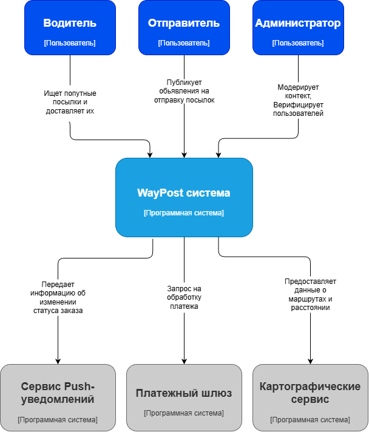
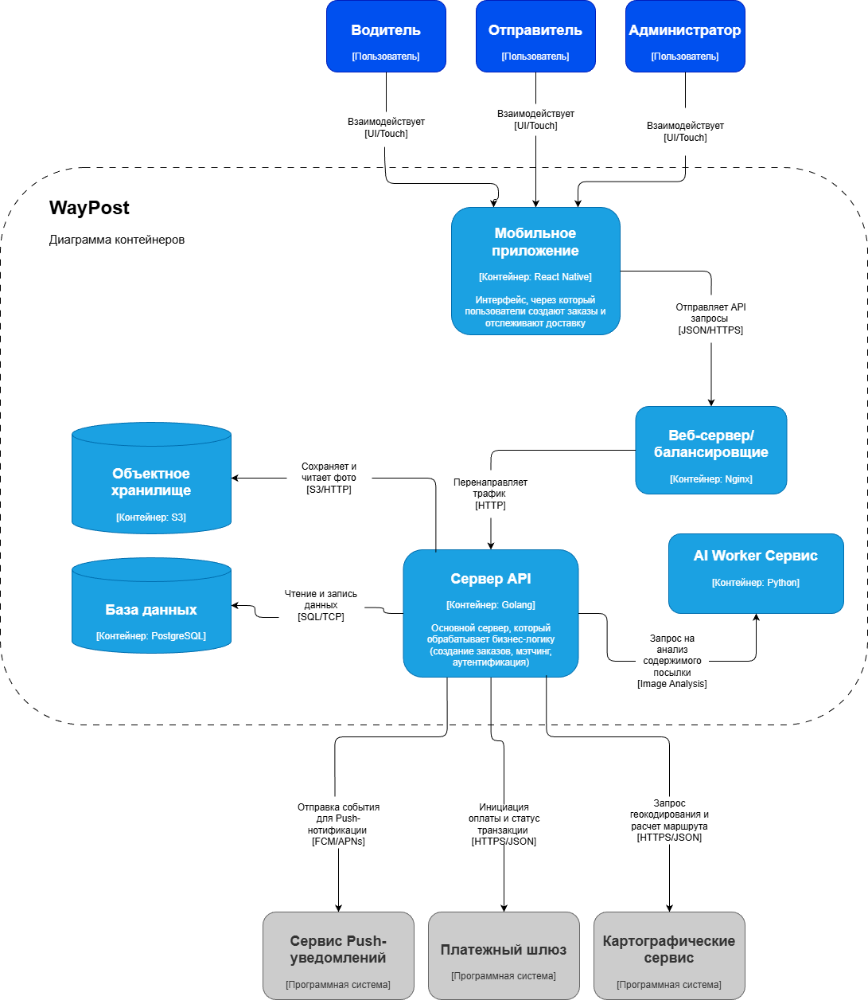

# WayPost

---

## Elevator Pitch
*   **Проблема:** Традиционная междугородняя доставка небольших вещей (ключи, документы, забытые дома зарядки) стоит неоправданно дорого и занимает минимум 2–3 дня 2.
*   **Решение:** Мобильное приложение, которое соединяет отправителя с обычным водителем, который уже едет по нужному маршруту 2.
*   **Киллер-фича:** Встроенный ИИ-модуль «Photo-Check AI», который автоматически анализирует фото посылки на предмет запрещенных вещей и оценивает её габариты для расчета честной цены 3.
*   **Профит:** Пользователь отправляет посылку «день в день» в 3 раза быстрее и на 50% дешевле, чем курьерской службой, а водитель окупает затраты на топливо.
*   **CTA:** Готовы узнать, как наш сервис поможет вашим пользователям доставлять забытые документы за пару часов без отмены планов?

---

## Lean Canvas


---

## Роли пользователей

*   **Пользователь:** Пользователь сервиса - отправляет/получает посылки.
*   **Водитель:** Водитель - доставляет посылки, получает выплаты.
*   **Администратор:** Администратор сервиса - отвечает за верификацию пользователей и решает спорные ситуации.

---

## User stories

| № | User Story | Приоритет |
| :--- | :--- | :--- |
| 1 | *Как пользователь*, я хочу зарегистрироваться по номеру телефона, чтобы создать личный профиль. | **Must** |
| 2 | *Как пользователь*, я хочу загрузить фото паспорта, чтобы пройти верификацию и получить статус проверенного аккаунта. | **Should** |
| 3 | *Как пользователь*, я хочу общаться во внутреннем чате, чтобы не раскрывать свой личный номер до подтверждения сделки. | **Should** |
| 4 | *Как пользователь*, я хочу получать Push-уведомления об изменении статуса моего заказа. | **Could** |
| 5 | *Как пользователь*, я хочу авторизоваться через Apple ID или Google Account для быстрого входа в приложение. | **Could** |
| 6 | *Как отправитель*, я хочу создать заявку с указанием маршрута, даты и описания посылки, чтобы найти водителя. | **Must** |
| 7 | *Как отправитель*, я хочу подтвердить выбор конкретного водителя из списка откликнувшихся, чтобы запустить сделку. | **Must** |
| 8 | *Как отправитель*, я хочу оплатить доставку картой в приложении, чтобы деньги были защищены до момента получения. | **Should** |
| 9 | *Как отправитель*, я хочу использовать Photo-Check AI для автоматической проверки содержимого посылки по фотографии. | **Could** |
| 10 | *Как отправитель*, я хочу заказывать международную доставку посылок с оформлением таможенных деклараций. | **Won't Have** |
| 11 | *Как водитель*, я хочу видеть ленту активных заявок на доставку по моему текущему или будущему маршруту. | **Must** |
| 12 | *Как водитель*, я хочу оставить отклик на заявку, чтобы предложить отправителю свои услуги по перевозке. | **Must** |
| 13 | *Как водитель*, я хочу получить выплату на свою карту автоматически после того, *как отправитель* подтвердит получение. | **Should** |
| 14 | *Как водитель*, я хочу видеть фильтры по габаритам посылок, чтобы выбирать только те, что поместятся в мой багажник. | **Could** |
| 15 | *Как водитель*, я хочу иметь встроенный навигатор с учетом пробок и перекрытий дорог внутри приложения. | **Won't Have** |

---

## Формирование MVP и MLP

### MVP "Скелет"

*   **Регистрация и профиль:** Создание аккаунта по номеру телефона (№1).
*   **Управление заказами:** Создание отправителем заявки с маршрутом и описанием (№6).
*   **Поиск и отклик:** Лента заявок для водителя и возможность предложить свои услуги (№11, №12).
*   **Завершение сделки:** Подтверждение выбора водителя отправителем для фиксации договоренности (№7).

### MLP "Вау эффект"

*   **Доверие и безопасность:** Верификация пользователей по паспорту для снижения рисков (№2).
*   **Финансовая защита:** Внедрение «Безопасной сделки» с холдированием средств до подтверждения доставки (№8).
*   **Коммуникация:** Встроенный чат для обсуждения деталей встречи без обмена личными номерами (№3).
*   **Киллер-фича (ИИ):** Использование Photo-Check AI для автоматического анализа содержимого посылки по фото (№9).

---

## Детализация требований

### Создание заявки на доставку (Отправитель) (№6)
*Как отправитель, я хочу создать заявку с указанием маршрута, даты и описания посылки, чтобы найти водителя*.

**Функциональные требования (FR):**
*   **FR 1:** Система должна позволять пользователю вводить точку отправления и точку прибытия с помощью автодополнения адресов (интеграция с картами).
*   **FR 2:** Система должна требовать обязательного выбора категории габаритов (Маленькая, Средняя, Большая).
*   **FR 3:** Система должна позволять загрузить до 3-х фотографий содержимого посылки перед публикацией.
*   **FR 4:** Система должна предоставлять поле для ввода предлагаемой стоимости доставки в рублях.

**Нефункциональные требования (NFR):**
*   **NFR 1 (Доступность):** Форма создания заявки должна корректно отображаться на мобильных устройствах с диагональю экрана от 4.7 дюймов.
*   **NFR 2 (Производительность):** Сохранение заявки в базе данных и её появление в общем поиске должно занимать не более 3 секунд после нажатия кнопки «Опубликовать».
*   **NFR 3 (Безопасность):** Все загружаемые изображения должны проходить автоматическую проверку на наличие вредоносного кода перед сохранением в хранилище S3.

### Просмотр и фильтрация доступных заявок (Водитель) (№11)
*Как водитель, я хочу видеть ленту активных заявок на доставку по моему текущему или будущему маршруту*.

**Функциональные требования (FR):**
*   **FR 1:** Система должна отображать список активных заявок, отсортированных по близости к указанному водителем маршруту.
*   **FR 2:** Система должна позволять фильтровать заявки по дате отправления (сегодня, завтра, диапазон дат).
*   **FR 3:** Система должна скрывать из ленты заявки, на которые уже назначен исполнитель или которые были отозваны отправителем.
*   **FR 4:** При клике на заявку система должна отображать детальную информацию: фото, описание, рейтинг отправителя и предложенную цену.

**Нефункциональные требования (NFR):**
*   **NFR 1 (Обновление данных):** Список доступных заявок должен обновляться автоматически (или по жесту тянуть-для-обновления) без полной перезагрузки приложения.
*   **NFR 2 (Надежность):** Система должна поддерживать корректное отображение списка при одновременном обращении до 1000 активных водителей в секунду.
*   **NFR 3 (Локализация):** Интерфейс ленты заявок и все системные уведомления должны быть полностью на русском языке (согласно настройкам проекта).

---

## DDD (Domain-Driven Design)

### Домен Identity & Profile (Профили и Доступ)
*   **Описание:** Отвечает за создание аккаунтов, хранение ролей (Отправитель/Водитель) и прохождение верификации
*   **Глоссарий:** 
    *   **User (Пользователь):** Лицо, зарегистрированное в системе
    *   **KYC (Know Your Customer):** Процесс проверки личности по паспорту
    *   **Trust Score (Рейтинг):** Показатель надежности на основе отзывов

### Домен Order Management (Управление заказами)
*   **Описание:** Обработка создания, редактирования, поиска и архивации объявлений о посылках
*   **Глоссарий:**
    *   **Order (Заказ/Заявка):** Объявление отправителя о необходимости доставки
    *   **Parcel (Посылка):** Объект перевозки с указанными габаритами и фото
    *   **Route (Маршрут):** Точки А и Б с указанием даты поездки

### Домен Shipping & Logistics (Логистика и Исполнение)
*   **Описание:** Система откликов, назначение водителя на заказ и отслеживание статуса доставки
*   **Глоссарий:**
    *   **Bid (Отклик):** Предложение водителя перевезти конкретную посылку
    *   **Status (Статус):** Состояние заказа (Ожидание, В пути, Доставлено)
    *   **Tracking (Трекинг):** Геопозиция водителя во время активной доставки.

### Домен Billing & Payments (Биллинг и Платежи)
*   **Описание:** Проведение оплаты, холдирование (заморозка) средств и выплата вознаграждения водителю.
*   **Глоссарий:**
    *   **Escrow (Безопасная сделка):** Механизм удержания денег до подтверждения услуги.
    *   **Payout (Выплата):** Перевод средств водителю после закрытия заказа.

---

## BDD (Behavior-Driven Development)

**Критический путь:** Процесс назначения водителя на заказ (Matching).

### Сценарий 1: Успешное принятие предложения (Success Path)
*   **Дано:** Отправитель создал заявку на доставку посылки из Москвы в Тулу
*   **И:** Водитель оставил отклик на эту заявку
*   **Когда:** Отправитель нажимает кнопку «Выбрать этого водителя» в списке откликов
*   **Тогда:** Статус заказа меняется на «Водитель назначен»
*   **И:** Система отправляет Push-уведомление водителю о том, что его выбрали

### Сценарий 2: Отказ из-за отсутствия оплаты (Failure Path)
*   **Дано:** Отправитель выбрал водителя для доставки
*   **И:** Система перевела пользователя на экран оплаты «Безопасной сделки»
*   **Когда:** Отправитель закрывает окно оплаты или на карте недостаточно средств
*   **Тогда:** Статус заказа остается «Ожидает оплаты»
*   **И:** Система выводит сообщение: «Ошибка транзакции. Оплатите заказ, чтобы водитель получил уведомление о старте»

---

## Wireframes


## API-Fisrs: JSON-контракты

### Ручка 1: Создание заявки

`POST /api/v1/orders`

**Запрос:**
```json
{
    "sender_id": 1,
    "route": {
        "from": {
            "address": "Калуга, улица Кирова, д. 52, ...",
            "coords": [55.751244, 37.618423]
        },
        "to": {
            "address": "Москва, Измайловский пр-т 73/2, ...",
            "coords": [55.751244, 37.618423]
        },
        "date": "2026-05-15T09:00:00Z"
    },
    "description": "Посылка из Калуги в Москву, Личные документы",
    "weight": 0.2,
    "size": "small",
    "offered_price": 500,
    "photos": ["https://example.com/1.jpg", "https://example.com/2.jpg"]
}
```

**Ответ:**
```json
{
    "order_id": "ord_112233",
    "status": "pending_moderation",
    "created_at": "2026-05-06T12:00:00Z",
    "ai_check_result": {
        "status": "processing",
        "estimated_seconds": 5
    }
}
```


### Ручка 2: Получение ленты заказов

`GET /api/v1/orders`

**Запрос без json тела**

**Ответ:**
```json
{
    "available": [
        {
            "sender_id": 1,
            "route": {
                "from": {
                    "address": "Калуга, улица Кирова, д. 52, ...",
                    "coords": [55.751244, 37.618423]
                },
                "to": {
                    "address": "Москва, Измайловский пр-т 73/2, ...",
                    "coords": [55.751244, 37.618423]
                },
                "date": "2026-05-15T09:00:00Z"
            },
            "description": "Посылка из Калуги в Москву, Личные документы",
            "weight": 0.2,
            "size": "small",
            "offered_price": 500,
            "photos": ["https://example.com/1.jpg", "https://example.com/2.jpg"]
        }
    ]
}
```

---

## Схема C4 (Архитектура системы)

### Уровень 1. Контекст Системы (System Context)



### Уровень 2. Контейнеры




---

## Технологический стек для MVP

*   **Мобильное приложение React Native:** Позволяет поддерживать единую кодовую базу для iOS и Android, обеспечивая при этом нативный доступ к камере для Photo-Check AI и GPS-модулю для трекинга посылок в реальном времени. Также разработке быстрее и дешевле, потому что не приходится разрабатывать сразу два приложения для iOS и Android.

*   **API сервис Golang:** Обеспечивает высокую скорость обработки конкурентных запросов (например, при массовых добавлениях заказов) и эффективную работу с памятью.

*   **База данных PostgreSQL:** Реляционная база данных для надежного хранения финансовых транзакций.

*   **Хранилище S3:** Выделенное файловое хранилище необходимо для загрузки тяжелых пользовательских файлов.

*   **Балансировщие Nginx:** Надежная точка входа, фильтрует запросы и редиректит их к API сервису.

*   **Ai worker (Python):** Обеспечивает быструю обработку фотографий для Photo-Check AI.

---

## Hiring Plan (План найма)

| Роль | Главные зоны ответственности |
| :--- | :--- |
| **Backend Developer (Go)** | 1. Разработка бизнес-логики заказов; 2. Интеграция с платежными шлюзами и гео-сервисами. |
| **Mobile Developer (React Native)** | 1. Создание кроссплатформенного приложения; 2. Работа с картами и камерой устройства. |
| **QA Engineer (Manual/Auto)** | 1. Тестирование критического пути (оплата, регистрация) и проверка корректности статусов заказа. |
| **AI/ML Engineer (Part-time)** | 1. Настройка и дообучение модели для Photo-Check AI (анализ содержимого посылок). |
| **Product Manager / Lead** | 1. Приоритизация бэклога, проектирование пользовательских путей и анализ метрик MVP. |

---

## Development Framework (Методология разработки)

Для WayPost выбран **Scrum**, так как он позволяет гибко реагировать на фидбек первых пользователей после запуска MVP.

*   **Итеративность:**  Работа короткими спринтами (2 недели) позволяет быстро выпускать обновления и исправлять ошибки в логике доставки. 
*   **Прозрачность:**  Четкие роли (Scrum Master, PO) и артефакты помогают команде видеть прогресс по каждой доменной зоне (DDD). 
*   **Адаптивность:**  Если Photo-Check AI будет работать нестабильно, мы сможем пересмотреть приоритеты прямо на следующем планировании. 

---

## Team Rituals (Командные ритуалы)
Ритуалы спроектированы так, чтобы синхронизировать разработку бэкенда и мобильного приложения.

| Ритуал | Цель встречи | Частота |
| :--- | :--- | :--- |
| **Daily Stand-up** | Синхронизация: что сделано вчера, план на сегодня и какие есть блокирующие проблемы (например, по API). | Ежедневно (15 мин) |
| **Sprint Planning** | Оценка задач из бэклога и формирование плана работ на следующие две недели. | Раз в 2 недели |
| **Grooming (Refinement)** | Детальный разбор новых User Stories и уточнение технических контрактов (JSON) перед разработкой. | Раз в неделю |
| **Sprint Review / Demo** | Демонстрация готового функционала (например, работающей оплаты) заказчику или стейкхолдерам. | Конец спринта |
| **Retrospective** | Обсуждение процессов: что помогло команде работать быстрее, а что мешало в текущем спринте. | Конец спринта |

---

## Управление рисками


| Тип риска | Описание риска | Уровень | Стратегия реагирования |
| :--- | :--- | :--- | :--- |
| **Внешний** | **Юридические риски:** Перевозка водителем запрещенных предметов (нелегальный контент). | **Критический** | Внедрение **Photo-Check AI** для обязательной премодерации посылок и верификация пользователей через KYC. |
| **Внешний** | **Безопасность средств:** Мошенничество со стороны водителя (забрал посылку и исчез). | **Высокий** | Использование **Безопасной сделки** (холдирование оплаты) и страхование груза через партнерские сервисы. |
| **Внутренний** | **Технический долг:** Сложность интеграции ИИ-модуля на Python с основным бэкендом на Go. | **Средний** | API-First подход: четкая спецификация JSON-контрактов и изоляция ИИ-сервиса в отдельный микроконтейнер. |
| **Внешний** | **Рыночный риск:** Низкая плотность заказов на старте (водители не находят попутные грузы). | **Высокий** | Фокусировка MVP на 1-2 популярных маршрутах (например, Москва - Калуга) для создания критической массы заказов. |
| **Внутренний** | **Ресурсный риск:** Уход ключевого разработчика (единственный Go-разработчик в команде). | **Средний** | Документирование кода (Swagger/OpenAPI) и проведение регулярных Code Review для обмена знаниями в команде. |
